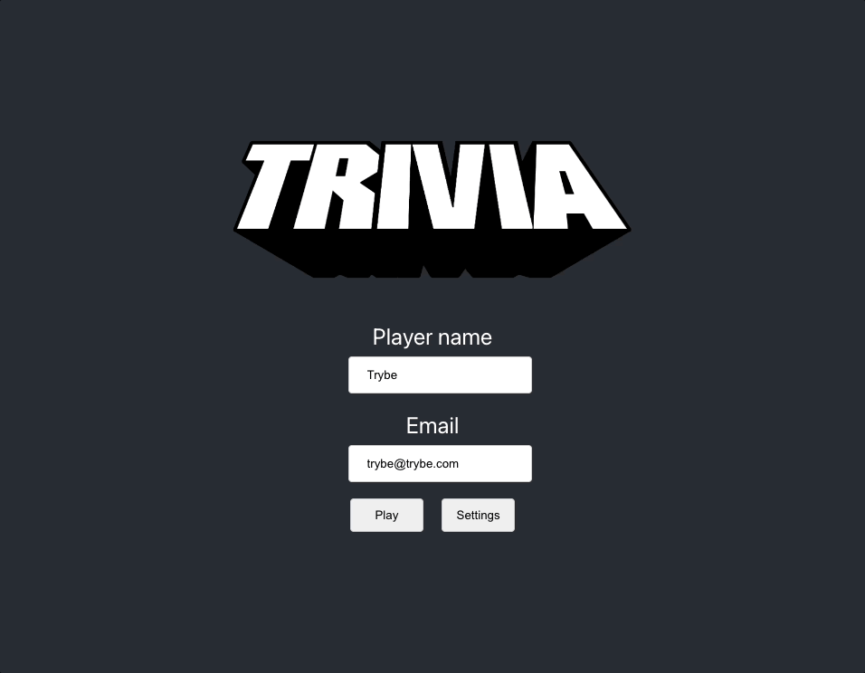

# Boas-vindas ao repositório do projeto de Trivia!

Para realizar o projeto, atente-se a cada passo descrito a seguir e, se tiver qualquer dúvida, nos envie por _Slack_! #vqv 🚀

Aqui você vai encontrar os detalhes de como estruturar o desenvolvimento do seu projeto a partir deste repositório, utilizando uma branch específica e um _Pull Request_ para colocar seus códigos.

# Termos e acordos

Ao iniciar este projeto, você concorda com as diretrizes do Código de Conduta e do Manual da Pessoa Estudante da Trybe.

# Entregáveis

<details>
  <summary><strong>🤷🏽‍♀️ Como entregar</strong></summary><br />

  Para entregar o seu projeto você deverá criar um *Pull Request* neste repositório.

  Lembre-se que você pode consultar nosso conteúdo sobre [Git & GitHub](https://app.betrybe.com/course/4d67f5b4-34a6-489f-a205-b6c7dc50fc16/) e nosso [Blog - Git & GitHub](https://blog.betrybe.com/tecnologia/git-e-github/) sempre que precisar!
</details>

<details>
  <summary><strong>👨‍💻 O que deverá ser desenvolvido</strong></summary><br />

Você deverá desenvolver um jogo de perguntas e respostas baseado no jogo **Trivia** _(tipo um show do milhão americano rs)_ utilizando _React e Redux_, desenvolvendo em grupo suas funcionalidades de acordo com as demandas definidas em um quadro _Kanban_. Confira o Slack para saber como acessar o quadro! Para viver um cenário mais próximo do mercado de trabalho, você deve fazer uma cópia desse quadro para utilizar com seu grupo. É de suma importância que o grupo se organize utilizando o quadro para maior eficiência e para que se minimizem os conflitos que a união de vários códigos trará. A partir dessas demandas, teremos uma aplicação onde a pessoa usuária poderá:

  - Logar no jogo e, se o email tiver cadastro no site [Gravatar](https://pt.gravatar.com/), ter sua foto associada ao perfil da pessoa usuária.
  - Acessar a página referente ao jogo, onde se deverá escolher uma das respostas disponíveis para cada uma das perguntas apresentadas. A resposta deve ser marcada antes do contador de tempo chegar a zero, caso contrário a resposta deverá ser considerada errada.
  - Ser redirecionada, após 5 perguntas respondidas, para a tela de score, onde o texto mostrado depende do número de acertos.
  - Visualizar a página de ranking, se quiser, ao final de cada jogo.
  - Configurar algumas opções para o jogo em uma tela de configuração acessível a partir do cabeçalho do app.

</details>

<details>
  <summary><strong>:memo: Habilidades</strong></summary><br />

Nesse projeto, você será capaz de:

  - Criar um store Redux em aplicações React

  - Criar reducers no Redux em aplicações React

  - Criar actions no Redux em aplicações React

  - Criar dispatchers no Redux em aplicações React

  - Conectar Redux aos componentes React

  - Criar actions assíncronas na sua aplicação React que faz uso de Redux.

  - Escrever testes para garantir que sua aplicação possua uma boa cobertura de testes.
</details>

<details>
  <summary><strong>🗓 Data de Entrega</strong></summary><br />
  
  * Este projeto é em grupo;
  * Serão `4` dias de projeto;
  * Data para entrega final do projeto: `28/02/2023 14:00`.

</details>

# Orientações

<details>
  <summary><strong>‼️ Antes de começar a desenvolver</strong></summary><br />

  1. Clone o repositório

  - Use o comando: `git clone git@github.com:tryber/sd-027-a-project-trivia-react-redux.git`.
  - Entre na pasta do repositório que você acabou de clonar:
    - `cd sd-027-a-project-trivia-react-redux`
  - Vá para a branch do seu grupo:
    - `git checkout main-group-XX && git pull`, onde `XX` é o número do seu grupo. Exemplos: `main-group-1`, `main-group-22`.

  2. Instale as dependências e inicialize o projeto

  - Instale as dependências:
    - `npm install`
  - Inicialize o projeto:
    - `npm start` (uma nova página deve abrir no seu navegador com um texto simples)
  
  3. Faça alterações separadas por novas branchs criadas a partir da branch `main-group-XX`, criando uma nova branch para cada demanda

  - Verifique que você está na branch `main-group-XX`
    - Exemplo: `git branch`
  - Se não estiver, mude para a branch `main-group-XX`
    - Exemplo: `git checkout main-group-XX && git pull`
  - Agora, crie uma branch para a demanda que você vai desenvolver do seu projeto
    - Você deve criar uma branch com uma breve descrição da demanda a ser desenvolvida
    - Exemplo: `git checkout -b main-group-XX-cria-campo-de-input`

  4. Adicione as mudanças ao _stage_ do Git e faça um `commit`

  - Verifique que as mudanças ainda não estão no _stage_
    - Exemplo: `git status` (devem aparecer listadas as novas alterações em vermelho)
  - Adicione o novo arquivo ao _stage_ do Git
    - Exemplo:
      - `git add .` (adicionando todas as mudanças - _que estavam em vermelho_ - ao stage do Git)
      - `git status` (devem aparecer listadas as novas alterações em verde)
  - Faça o `commit`
    - Exemplo:
      - `git commit -m 'cria componente de input'` (fazendo o primeiro commit)
      - `git status` (deve aparecer uma mensagem tipo _nothing to commit_ )

  5. Adicione a sua branch com o novo `commit` ao repositório remoto

  - Usando o exemplo anterior: `git push -u origin main-group-XX-cria-campo-de-input`

  6. Crie um novo `Pull Request` _(PR)_

  - Vá até a página de _Pull Requests_ do [repositório no GitHub](https://github.com/tryber/sd-027-a-project-trivia-react-redux/pulls)
  - Clique no botão verde _"New pull request"_
  - Clique na caixa de seleção _"Compare"_ e escolha a sua branch **com atenção**
  - Coloque um título para a sua _Pull Request_
    - Exemplo: _"[GRUPO XX] Cria tela de busca"_
  - Clique no botão verde _"Create pull request"_
  - Adicione uma descrição para o _Pull Request_ e clique no botão verde _"Create pull request"_
  - **Não se preocupe em preencher mais nada por enquanto!**
  - Volte até a [página de _Pull Requests_ do repositório](https://github.com/tryber/sd-027-a-project-trivia-react-redux/pulls) e confira que o seu _Pull Request_ está criado

  7. Assim que aprovado por pelo menos duas pessoas do seu grupo e o _Linter_ estiver adereçado, acesse **SEU** _Pull Request_ e clique no botão _"Merge pull request"_

</details>

<details>
  <summary><strong>⌨️ Durante o desenvolvimento</strong></summary><br />

  - Faça `commits` das alterações que você fizer no código regularmente

  - Lembre-se de sempre após um (ou alguns) `commits` atualizar o repositório remoto

  - Os comandos que você utilizará com mais frequência são:
    1. `git status` _(para verificar o que está em vermelho - fora do stage - e o que está em verde - no stage)_
    2. `git add` _(para adicionar arquivos ao stage do Git)_
    3. `git commit` _(para criar um commit com os arquivos que estão no stage do Git)_
    4. `git push -u origin nome-da-branch` _(para enviar o commit para o repositório remoto na primeira vez que fizer o `push` de uma nova branch)_
    5. `git push` _(para enviar o commit para o repositório remoto após o passo anterior)_

</details>

<details>
  <summary><strong>🤝 Depois de terminar o desenvolvimento (opcional)</strong></summary><br />

  Para sinalizar que o seu projeto está pronto para o _"Code Review"_, faça o seguinte:

  - Vá até a página **DO SEU** _Pull Request_, adicione a label de _"code-review"_ e marque seus colegas:

    - No menu à direita, clique no _link_ **"Labels"** e escolha a _label_ **code-review**;

    - No menu à direita, clique no _link_ **"Assignees"** e escolha **o seu usuário**;

    - No menu à direita, clique no _link_ **"Reviewers"** e digite `students`, selecione o time `tryber/students-sd-027-a`.

  Caso tenha alguma dúvida, [aqui tem um video explicativo](https://vimeo.com/362189205).

</details>

<details>
  <summary><strong>🕵🏿 Revisando um pull request</strong></summary><br />

  Use o conteúdo sobre [Code Review](https://course.betrybe.com/real-life-engineer/code-review/) para te ajudar a revisar os _Pull Requests_.

</details>

<details>
  <summary><strong>🎛 Linter</strong></summary><br />

Usaremos o [ESLint](https://eslint.org/) para fazer a análise estática do seu código.

Para garantir a qualidade do seu código de forma a tê-lo mais legível, de mais fácil manutenção e seguindo as boas práticas de desenvolvimento nós utilizamos neste projeto o linter `ESLint` e `StyleLint`. Para rodar o linter localmente no seu projeto, execute os comandos abaixo:

```bash
npm run lint
npm run lint:styles
```
Caso ainda fique alguma dúvida, você pode consultar nosso conteúdo sobre [`ESLint`](https://app.betrybe.com/course/real-life-engineer/eslint)

⚠ **PULL REQUESTS COM ISSUES DE LINTER NÃO SERÃO AVALIADAS. ATENTE-SE PARA RESOLVÊ-LAS ANTES DE FINALIZAR O DESENVOLVIMENTO!** ⚠

Você pode também instalar o plugin do `ESLint` no `VSCode`, bastar ir em extensions e baixar o [plugin `ESLint`](https://marketplace.visualstudio.com/items?itemName=dbaeumer.vscode-eslint).
</details>

<details>
  <summary><strong>:busts_in_silhouette: Trello como ferramenta Kanban</strong></summary><br />

  Uma forma para seu grupo organizar as atividades e dividir as tarefas é através de um modelo de kanban. A Trybe disponibiliza um [board pré-configurado para vocês](https://trello.com/b/2mZxlQC7/trivia-react-redux-startest) duplicarem no [Trello](https://trello.com/).


Para duplicar, basta seguir os passos:

- Acesse o [link do board](https://trello.com/b/2mZxlQC7/trivia-react-redux-startest)
- Abra o menu no canto superior direito
- Selecione "copiar quadros"
- Defina o time do seu grupo e um título para o board
- Clique em `criar`
- Personalize seu novo kanban!
</details>

<details>
  <summary><strong>🛠 Testes</strong></summary><br />

* <details><summary><b> Execução de testes de requisito</b></summary>

  Os testes deste projeto foram feitos utilizando o [Cypress](https://www.cypress.io/how-it-works/). É utilizada nos testes a resolução `1366 x 768` (1366 pixels de largura por 768 pixels de altura) para testes de layout. Logo, recomenda-se desenvolver seu projeto usando a mesma resolução, via instalação [deste plugin](https://chrome.google.com/webstore/detail/window-resizer/kkelicaakdanhinjdeammmilcgefonfh?hl=en) do `Chrome` para facilitar a configuração dessa resolução, por exemplo.

  Para o projeto ser validado, todos os testes de comportamento devem passar. É possível testar isso local rodando `npm run cy`. Esse comando roda a suite de testes do Cypress que valida se o fluxo geral e os requisitos funcionais estão funcionando como deveriam. Você pode também executar o comando `npm run cy:open` para ter um resultado visual dos testes executados.

  Esses testes não consideram o layout de maneira geral, mas sim os atributos e informações corretas, então preste atenção nisso! Os testes te darão uma mensagem de erro caso não estejam passando (seja qual for o motivo). 😉
  </details>

* <details><summary><b> Execução de um teste específico</b></summary>

  Para executar somente uma `spec` de testes, você pode selecionar qual delas você deseja após executar o comando `npm run cy:open`. Além disto você pode rodar todas as `specs` clicando no botão `Run all specs`.

  

  **Atenção:** Sua aplicação deve estar rodando para o Cypress no terminal poder testar.
  </details>

* <details><summary><b> Execução de teste de cobertura</b></summary>

  Alguns requisitos irão pedir para que você desenvolva testes para sua aplicação. Esses testes serão avaliados através da cobertura de testes.

  É possível verificar o percentual da cobertura de testes com o comando `npm run test:coverage`. 

  Você também pode executar `npm run test:coverage -- --collectCoverageFrom=caminho/da/Pagina` para verificar o percentual de cobertura de testes de cada 'Pagina'. Por exemplo, para verificar a cobertura de testes da página de `Login`, execute o comando:
  ```console
    npm run test:coverage -- --collectCoverageFrom=src/pages/Login.js
  ```
  </details><br />
</details>

<details>
<summary><strong>:convenience_store: Desenvolvimento </strong></summary><br />

  * <details><summary><b> Como desenvolver :technologist:</b></summary>

    Nesse projeto, a pessoa que joga deve conseguir completar o jogo e conseguir ver seu placar depois de responder todas as 5 perguntas, além de acessar a tela de configurações e de ranking.

    :warning: **Lembrem-se de utilizar os conhecimentos adquiridos ao longo dos últimos projetos nas ferramentas do React como o Router, Link, Redux e testes para ajudá-los a completar os requisitos.** :warning:

    Este repositório **já conta com uma `main-group` para cada grupo**, identificada como `main-group-1` para o grupo 1, `main-group-2` para o grupo 2, e assim por diante. Para desenvolver, você sempre deve:

      * **Criar sua branch de desenvolvimento a partir da sua branch main**. Para isso, clone este repositório, faça o `git checkout main-group-XX && git pull` e em seguida o `git checkout -b main-group-XX-minha-feature`.
      * Para criar uma Pull Request para fazer **Code Review**, entitule-a `[GRUPO XX] Meu título` e **sempre aponte a Pull Request da sua branch para a branch `main-group-XX` do seu grupo, como no exemplo abaixo:**

    <details><summary> Exemplo de como apontar um PR para a branch main do grupo</summary>

      
    </details>

      * Quando várias pessoas desenvolvem para um mesmo projeto podem ocorrer **conflitos de merge** que precisarão ser resolvidos. Prestem atenção a isso!

      ⚠ **ATENÇÃO! É POSSÍVEL COMMITAR, POR ENGANO, NA BRANCH DE OUTRO GRUPO, ENTÃO TOME MUITO CUIDADO** ⚠

      Para o bom andamento deste projeto disponibilizamos, além do README, um _quadro Kanban_ com as demandas a realizar para o projeto ser concluído com sucesso. Confira o _Slack_ para saber como acessar o quadro! É de suma importância que o grupo se organize utilizando o quadro para maior eficiência e para que se minimizem os conflitos que a união de vários códigos trará.

      Além disso, você verá que os requisitos do projeto tem, além das observações técnicas e do que será validado, descrições tais quais se veriam em um projeto real. **É muito importante ser capaz de ler descrições como essas e transformá-las em produtos ou, se houver dúvida, saber tirar tais dúvidas!** Seguimos à disposição no Slack para isso.

      Este repositório já contém um _template_ com um App React criado, configurado e com os testes automatizados que fazem parte da correção. Ele também conta com uma branch **main-group** para cada grupo, identificada como `main-group-1` para o grupo 1, `main-group-2` para o grupo 2 e assim por diante.
    </details>

  * <details><summary><b><i>Helper</i> <code>renderWithRouterAndRedux</code> :gear:</b></summary>

    Você encontrará no projeto o arquivo `src/tests/helpers/renderWithRouterAndRedux.js`, que é um _helper_ que pode te ajudar no desenvolvimento dos testes. Esse _helper_ serve para que você possa renderizar sua aplicação com a `store` e com o `history` já mockados.

    Você deve importar a função em seus arquivos de testes e passar os seguintes parâmetros:
      - `component` (obrigatório): é o componente que será renderizado. Geralmente o componente `<App />`.
      - `initialState` (opcional): um objeto que representa o estado da sua aplicação. Útil para quando você quiser testar algum comportamento específico a partir de um determinado estado.
      - `route` (opcional): você pode usar esse parâmetro para configurar em qual caminho sua aplicação iniciará o teste. Exemplo: `/feedback` ou `/ranking`.

    * <details><summary><i> Exemplo 1 - renderizar aplicação na página inicial sem nenhum estado definido:</i></summary>

      ```jsx 
      //src/tests/my-teste.spec.js
      import renderWithRouterAndRedux from './helpers/renderWithRouterAndRedux';

      //...
        renderWithRouterAndRedux(<App />);
      //...

      ```
      </details>

    * <details><summary><i> Exemplo 2 - renderizar aplicação na página inicial com um estado definido:</i></summary>

      ```jsx 
      //src/tests/my-teste.spec.js
      import renderWithRouterAndRedux from './helpers/renderWithRouterAndRedux';

      const initialState = {
        token: "mockedToken",
        player: {
          name: 'Player Name',
          gravatarEmail: 'player@email.com',
          score: 0,
          assertions: 0,
        }
      }

      //...
        renderWithRouterAndRedux(<App />, initialState);
      //...

      ```
      </details>

    * <details><summary><i> Exemplo 3 - renderizar aplicação na página de feedback com um estado definido:</i></summary>

      ```jsx 
      //src/tests/my-teste.spec.js
      import renderWithRouterAndRedux from './helpers/renderWithRouterAndRedux';

      const initialState = {
        token: "mockedToken",
        player: {
          name: 'Player Name',
          gravatarEmail: 'player@email.com',
          score: 0,
          assertions: 0,
        }
      }

      //...
        renderWithRouterAndRedux(<App />, initialState, "/feedback");
      //...

      ```
      </details>
    </details>

  * <details><summary><b>Lidando com os testes que envolvem timers :clock1:</b></summary>

    Neste projeto será necessário usar timers em alguns requisitos. Consequentemente, você terá que lidar com esses timers durante o desenvolvimento dos seus testes.
    Veja esses dois links abaixo, eles podem te ajudar a pensar em soluções para esses casos:
    - [Usando o `jest.setTimeout()` para aumentar o tempo máximo de cada teste](https://jestjs.io/docs/jest-object#jestsettimeouttimeout)
    - [Usando o `findBy`, `waitFor` e `waitForElementToBeRemoved` para esperar ações acontecerem](https://testing-library.com/docs/dom-testing-library/api-async/) (💡 repare bem na opção `timeout` desses métodos)

    > Caso você queira se aprofundar ainda mais nesse tema, você pode ver também a página [Simulando temporizadores com Jest](https://jestjs.io/pt-BR/docs/timer-mocks).
    </details>

  * <details><summary><b> API de Trivia :game_die:</b></summary>

    A [API do Trivia](https://opentdb.com/api_config.php) é bem simples. Temos 2 endpoints que vamos precisar utilizar para esse exercício.

    * **Pegar o token de sessão da pessoa que está jogando**
    * **Pegar perguntas e respostas**

    Primeiro, é necessário fazer um GET request para:

    ```
    https://opentdb.com/api_token.php?command=request
    ```

    Esse endpoint te retornará o token que vai ser utilizado nas requisições seguintes. A resposta dele será:

    ```json
    {
      "response_code":0,
      "response_message":"Token Generated Successfully!",
      "token":"f00cb469ce38726ee00a7c6836761b0a4fb808181a125dcde6d50a9f3c9127b6"
    }
    ```

    Para pegar as perguntas, você deve realizar um GET request para o seguinte endpoint:

    ```javascript
    https://opentdb.com/api.php?amount=${quantidade-de-perguntas-retornadas}&token=${seu-token-aqui}

    // Recomendação
    https://opentdb.com/api.php?amount=5&token=${seu-token-aqui}
    ```

    Recomendamos pedir 5 perguntas de uma vez e controlar a disposição delas no código. Essa API te retorna as perguntas no seguinte formato:

    ```json
    // Pergunta de múltipla escolha
    {
      "response_code":0,
      "results":[
          {
            "category":"Entertainment: Video Games",
            "type":"multiple",
            "difficulty":"easy",
            "question":"What is the first weapon you acquire in Half-Life?",
            "correct_answer":"A crowbar",
            "incorrect_answers":[
                "A pistol",
                "The H.E.V suit",
                "Your fists"
            ]
          }
      ]
    }
    ```

    ```json
    // Pergunta de verdadeiro ou falso
    {
      "response_code":0,
      "results":[
          {
            "category":"Entertainment: Video Games",
            "type":"boolean",
            "difficulty":"hard",
            "question":"TF2: Sentry rocket damage falloff is calculated based on the distance between the sentry and the enemy, not the engineer and the enemy",
            "correct_answer":"False",
            "incorrect_answers":[
                "True"
            ]
          }
      ]
    }
    ```
    O token expira em 6 horas e te retornará um `response_code: 3` caso esteja expirado. **Atenção para que seu código contemple isso!** Caso o token seja inválido, essa será a resposta da API:

    ```json
    {
      "response_code":3,
      "results":[]
    }
    ```
    </details>

  * <details><summary><b> Gravatar :bust_in_silhouette:</b></summary>

    O Gravatar é um serviço que permite deixar o avatar global a partir do email cadastrado, ele mostra sua foto cadastrada em qualquer site vinculado. Na tela de **Inicio**, a pessoa que joga pode colocar um e-mail que deve fazer uma consulta a API do [Gravatar](https://br.gravatar.com/site/implement/images/).

    A Implementação é feita baseada no e-mail. Esse email deve ser transformado em uma hash `MD5` (https://br.gravatar.com/site/implement/hash/). Para gerar tal hash, recomendamos utilizar o [CryptoJs](https://github.com/brix/crypto-js).

    Por exemplo:
      - Garantida a instalação do CryptoJS no projeto, importe o MD5:
        `import md5 from 'crypto-js/md5';`

      - Converta o email do usuário:
        `md5(emailDoUsuário).toString();`

    **Atenção:** Precisamos utilizar o `toString()` ao final da conversão.

    Após a geração da hash, basta adicionar o valor gerado no final da URL:

    ```javascript
    // Formato de URL necessário:
    https://www.gravatar.com/avatar/${hash-gerada}

    // Exemplo de URL com hash de uma pessoa
    https://www.gravatar.com/avatar/205e460b479e2e5b48aec07710c08d50

    // Exemplo de imagem exibida com a URL
    

    ```
    </details>

  * <details><summary><b> Grupos de prioridade :bulb:</b></summary>

    Os requisitos são organizados por **grupos de prioridade por tela**. O objetivo é que o grupo possa se organizar melhor para que uma pessoa não fique totalmente dependente de outra para começar uma tarefa de outra tela. **Demandas de um grupo de prioridade podem ser realizadas em paralelo, e são pré-requisito para as demandas do grupo de prioridade seguinte.** Por exemplo:

      - A tela de Login possui como prioridade 0 a criação do input de nome e email, mas só é possível fazer a ação de habilitar/desabilitar botão e salvar o token do usuário (prioridade 1), quando os inputs estiverem prontos.
      - O primeiro requisito da tela de Jogo "Crie um header que deve conter as informações da pessoa jogadora" tem prioridade 1, ou seja, ele pode ser criado em paralelo mas depende das informações vindas da tela de Jogo para que o requisito seja aprovado.
      - Prioridades 2 são aquelas que dependem de outros requisitos, por exemplo, "A pergunta deve ter apenas uma alternativa correta", ou seja, depende que o requisito 1 esteja pronto para ser realizada.
      - Prioridades 3 são os ajustes finais, de prioridade baixa, que podem ou não depender de outros requisitos mas que não possuem dependentes. 

    Se você não seguir a ordem de prioridades terá que lidar com mais **conflitos de merge** e **demandas concorrentes**, onde o avanço de uma depende, na maioria das vezes, do avanço de outra para poder acontecer. **Ainda que siga a ordem de prioridade, no entanto, conflitos podem ocorrer a depender de como for feita a implementação do projeto, então é importante que o grupo faça esse alinhamento constantemente!**

    **ATENÇÃO!** 
    O avaliador testa a aplicação de maneira integrada. Ou seja: a tela de jogo só é aprovada quando a tela de login estiver pronta; As telas de ranking e feedback só serão aprovadas depois que as telas de login e jogo estiverem prontas. **É possível fazer as telas de jogo, ranking e feedback em paralelo, se a estrutura dos componentes for combinada pelo grupo!** Faz parte do desafio o desenvolvimento da aplicação sem o "acompanhamento" constante do avaliador. 

    Recomendamos, além disso, que os **requisitos de uma mesma tela** sejam feitos em sequência ou paralelamente por pessoas se comunicando _bastante_, para não haver conflitos. Embora requisitos de uma mesma tela com prioridades iguais possam ser feitos em paralelo, isso exigirá organização por parte das pessoas dividindo a tarefa para não haver conflitos.
    </details>

  * <details><summary><b> Observações técnicas :information_source:</b></summary>

    Algumas coisas devem seguir um padrão pré-estabelecido para que os testes de correção funcionem corretamente.

    <details><summary><b> Gerenciamento de Estado</b></summary>

    Utilizar o Redux para fazer o gerenciamento de estado da sua aplicação.
    </details>

    <details><summary><b> Store do Redux</b></summary>

    Para que os testes consigam acessar a `store` do redux e realizar os testes, é necessário adicionar o seguinte bloco de código ao arquivo da `store`:

    ```javascript
    if (window.Cypress) {
      window.store = store;
    }
    ```

    Ao importar a função `createStore` do `redux` o seguinte aviso surgirá: 

    > @deprecated: We recommend using the configureStore method of the @reduxjs/toolkit package, which replaces createStore.

    Isso acontece pois recentemente foi lançada a biblioteca `@redux/toolkit`, e como forma de incentivar as pessoas a usarem essa nova biblioteca, a equipe de desenvolvimento do Redux decidiu marcar o método `createStore` como _deprecated_.

    Use o seguinte código para importar a `createStore` sem o aviso de _deprecated_:

    ```jsx
    import { legacy_createStore as createStore} from 'redux'
    ```
    </details>

    <details><summary><b> Estado no Redux</b></summary>

    * A chave `player` deve conter a seguinte estrutura:
    ```javascript
    {
      name: nome-da-pessoa,
      assertions: número-de-acertos,
      score: pontuação,
      gravatarEmail: email-da-pessoa,
    }
    ```
    </details>

    <details><summary><b>LocalStorage</b></summary>

    É necessário guardar o ranking e o token no `localStorage` para que eles não sejam perdidos ao atualizar a página.

    O `localStorage` deve conter as chaves `ranking` e `token` com a seguinte estrutura:
    ```js
    {
      ranking: [
        { name: nome_da_pessoa, score: 10, picture: url_da_foto_no_gravatar }
      ],
      token: token_recebido_pela_API
    }
    ```
    </details>
    </details><br />
</details>

<details>
  <summary><strong>🗣 Nos dê feedbacks sobre o projeto!</strong></summary><br />

Ao finalizar e submeter o projeto, não se esqueça de avaliar sua experiência preenchendo o formulário. 
**Leva menos de 3 minutos!**

[FORMULÁRIO DE AVALIAÇÃO DE PROJETO](https://be-trybe.typeform.com/to/ZTeR4IbH)

</details>

<details>
  <summary><strong>💻 Protótipo do projeto no Figma</strong></summary><br />

Além da qualidade do código e do atendimento aos requisitos, um bom layout é um dos aspectos responsáveis por melhorar a usabilidade de uma aplicação e turbinar seu portfólio!

Você pode estar se perguntando: *"Como deixo meu projeto com um layout mais atrativo?"* 🤔

Para isso, disponibilizamos esse [protótipo do Figma](https://www.figma.com/file/59PXrUUfqaRT9P3oDsKVDS/%5BProjeto%5D%5BFrontend%5D-Trivia) para lhe ajudar !

⚠️ A estilização de sua aplicação não será avaliada nesse projeto, portanto esse protótipo é apenas uma **sugestão** e seu uso é **opcional**. Sinta-se à vontade para modificar o layout e deixá-lo do seu jeito.

</details>

<details>
  <summary><strong>🗂 Compartilhe seu portfólio!</strong></summary><br />

  Você sabia que o LinkedIn é a principal rede social profissional e compartilhar o seu aprendizado lá é muito importante para quem deseja construir uma carreira de sucesso? Compartilhe esse projeto no seu LinkedIn, marque o perfil da Trybe (@trybe) e mostre para a sua rede toda a sua evolução.
</details><br />

# Requisitos

:warning: **PULL REQUESTS COM ISSUES DE LINTER NÃO SERÃO AVALIADAS.** :warning:

Nesse projeto, a pessoa que joga deve conseguir completar o jogo e conseguir ver seu placar depois de responder todas as 5 perguntas, além de acessar a tela de configurações e de ranking.

:warning: **Lembrem-se de utilizar os conhecimentos adquiridos ao longo dos últimos projetos nas ferramentas do React como o Router, Link, Redux e testes para ajudá-los a completar os requisitos.** :warning:

## Tela de início/login

>Obs: É necessário que a página de Login tenha o caminho `src/pages/Login.js`

## 1. Crie a tela de login, onde a pessoa que joga deve preencher as informações para iniciar um jogo

**PRIORIDADE 0**

Criar a tela de login contendo as informações de nome e email, onde a pessoa que joga deve conseguir escrever seu nome e email nos inputs e o botão de jogar ("Play") deve estar desabilitado caso não tenha alguma dessas informações.
  
:bulb: Recomendamos que o Redux e o Router sejam configurados nesse requisito, para que os demais possam ser feitos paralelamente!

:warning: **Lembre-se das observações técnicas descritas acima para configurar a `store` do `Redux`.**

<details>
  <summary><strong> Observações técnicas:</strong></summary>

  * A pessoa que joga deve conseguir escrever seu nome no input de texto
  * A pessoa que joga deve conseguir escrever seu email no input de email
  * O botão "Play" deve ser desabilitado caso email e/ou nome não estejam preenchidos
  * O campo de texto para o nome deve possuir o atributo `data-testid` com o valor `input-player-name`
  * O campo de texto para o email deve possuir o atributo `data-testid` com o valor `input-gravatar-email`
  * O botão "Play" que leva a pessoa ao jogo deve possuir o atributo `data-testid` com o valor `btn-play`
</details>
<br /><details>
  <summary><strong>O que será verificado</strong></summary>

  * Será validado se é possível escrever o nome da pessoa jogadora
  * Será validado se é possível escrever o email da pessoa jogadora
  * Será validado se o botão "Play" está desabilitado quando a pessoa jogadora não preencher nenhum campo
  * Será validado se o botão "Play" está desabilitado quando a pessoa jogadora escrever apenas o nome
  * Será validado se o botão "Play" está desabilitado quando a pessoa jogadora escrever apenas o email
  * Será validado se o botão "Play" está habilitado quando a pessoa jogadora preencher os campos de nome e email
</details>

---

## 2. Crie o botão de iniciar o jogo

  **PRIORIDADE 1**
  
  O botão "Play" deve fazer requisição para a API para obter o token e redirecionar a pessoa para tela de jogo

<details>
  <summary><strong> Observações técnicas:</strong></summary>

  * Ao clicar no botão "Play", uma requisição para a API do Trivia deve ser feita para obter o _token_ de jogador
  * Após clicar no botão "Play", a pessoa deve ser redirecionada para a tela do jogo. O redirecionamento deve acontecer somente após o retorno do token pela API.
  * O _token_ deve ser armazenado e enviado em todas as requisições seguintes.
  * Salve no `localStorage` o valor do _token_ recebido na API do Trivia, utilizando a chave `token`.
</details>
<br /><details>
  <summary><strong>O que será verificado</strong></summary>

  * Será validado se ao clicar no botão "Play" o jogo é iniciado salvando um token de jogador
</details>

---

## 3. Crie um botão que leva a pessoa para tela de configuração

  **PRIORIDADE 1**
  
  A tela inicial deve conter um botão que leve para a configuração do jogo

<details>
  <summary><strong> Observações técnicas:</strong></summary>

  * O botão que leva a pessoa a tela de configurações deve possuir o atributo `data-testid` com o valor `btn-settings`
  * A tela de configurações deve possuir um título com o atributo `data-testid` contendo o valor `settings-title`
</details>
<br /><details>
  <summary><strong>O que será verificado</strong></summary>

  * Será validado se o botão existe na página
  * Será validado se a tela de configurações possui um título
</details>

---

## 4. Desenvolva testes para atingir 90% de cobertura da tela de Login

> :bulb: Obs: Neste requisito vamos cobrir a nossa tela de login com testes unitários utilizando a biblioteca [React Testing Library](https://testing-library.com/docs/react-testing-library/intro/), aproveite essa oportunidade para colocar em prática o [Desenvolvimento Orientado por Testes](https://blog.betrybe.com/tecnologia/tdd-test-driven-development/)

  **PRIORIDADE 1**
  
  Cobertura de testes da tela de Login

<details>
  <summary><strong> Observações técnicas:</strong></summary>

  * Os testes criados por você não irão influenciar os outros requisitos no avaliador. Você deverá desenvolver seus testes unitários/integração usando a biblioteca React Testing Library, enquanto o avaliador usará a biblioteca [Cypress](https://docs.cypress.io/) para avaliar os requisitos, inclusive os de cobertura.
  * Para os testes passarem é necessário que a página de Login tenha o caminho `src/pages/Login.js`
</details>
<br /><details>
  <summary><strong>O que será verificado</strong></summary>

  * Será validado se ao executar `npm run test-coverage` é obtido os seguintes resultados:
      * `% Funcs` e `% Lines` da linha `Login` é maior ou igual a 90.
</details>

---

## Tela de jogo

>Obs: É necessário que a página de Game tenha o caminho `src/pages/Game.js`

## 5. Crie um _header_ que deve conter as informações da pessoa jogadora

  **PRIORIDADE 1**
  
  O _header_ deve conter as informações sobre a pessoa jogadora, como a imagem do Gravatar, o nome e o placar

<details>
  <summary><strong> Observações técnicas:</strong></summary>

  * A imagem do perfil vinda do Gravatar em um elemento que deve possuir o atributo `data-testid` com o valor `header-profile-picture`
  * O nome da pessoa em um elemento que deve possuir o atributo `data-testid` com o valor `header-player-name`
  * O placar zerado em um elemento que deve possuir o atributo `data-testid` com o valor `header-score`
</details>

<br /><details>
  <summary><strong>O que será verificado</strong></summary>

  * Será validado se a imagem do Gravatar está presente no header
  * Será validado se o nome da pessoa está presente no header
  * Será validado se o placar zerado está presente no header
</details>

---

## 6. Crie a página de jogo que deve conter as informações relacionadas à pergunta

  **PRIORIDADE 1**
  
  Deve ser feita a requisição para a API para popular o jogo com as perguntas, categoria e alternativas

<details><summary> Ilustração:</summary>

  
</details><br />
<details>
  <summary><strong> Observações técnicas:</strong></summary>

  * Acessar o jogo com um token inválido leva a um logout, excluindo o token do `localStorage` e redirecionando a página para a tela de login
  * A pergunta e suas alternativas de resposta devem ser recebidas da API do Trivia
  * Apenas **uma** pergunta deve ser exibida por vez
  * A categoria da pergunta (campo _category_) deve ser exibida em um elemento com o atributo `data-testid` com o valor `question-category` para a pessoa que está jogando
  * O texto da pergunta (campo _question_) deve ser exibido em um elemento com o atributo `data-testid` com o valor `question-text` para a pessoa que está jogando
  * <details><summary> O texto com as alternativas devem ser exibidos seguindo as regras abaixo:</summary>

    * Os botões das alternativas devem ser elementos irmãos; ou seja, não podem estar dentro de outra tag
    * O elemento com a alternativa correta deve possuir o atributo `data-testid` com o valor `correct-answer`
    * Os elementos com as alternativas incorretas devem possuir o atributo `data-testid` com o valor `wrong-answer-${index}`, com `${index}` iniciando com o valor `0`
    * As alternativas devem estar dentro de uma tag que possui o atributo `data-testid` com o valor `answer-options`
    * As alternativas devem ser exibidas em ordem aleatória
    * Dica: utilize botões (`<button/>`) para as alternativas
  </details>
</details>

<br /><details>
  <summary><strong>O que será verificado</strong></summary>

  * Será validado se o token inválido é excluído e a aplicação é redirecionada
  * Será validado se as respostas da API são tratadas corretamente
  * Será validado se a categoria da pergunta está presente
  * Será validado se o texto da pergunta está presente
  * Será validado se as alternativas estão presentes
  * Será validado se a quantidade de alternativas corretas é 1
  * Será validado se as alternativas estão posicionadas em ordem aleatória
</details>

---

## 7. Desenvolva o estilo que, ao clicar em uma resposta, a correta deve ficar verde e as incorretas, vermelhas

  **PRIORIDADE 2**
  
  Ao responder a pergunta, se a alternativa for correta, deve ficar verde, caso contrário, vermelha

<details>
  <summary><strong> Observações técnicas:</strong></summary>

  * Utilize a propriedade css `border` com o valor `3px solid rgb(6, 240, 15)` para a alternativa correta.
  * Utilize a propriedade css `border` com o valor `3px solid red` para as alternativas incorretas.
</details>

<br /><details>
  <summary><strong>O que será verificado</strong></summary>

  * Será validado se a cor da alternativa correta é "rgb(6, 240, 15)" ao acertar a questão
  * Será validado se a cor das alternativas incorretas é definida como "red" ao acertar a questão.
  * Será validado se a cor da alternativa correta é "rgb(6, 240, 15)" ao errar a questão
  * Será validado se a cor das alternativas incorretas é definida como "red" ao errar a questão
</details>

---

## 8. Desenvolva um timer onde a pessoa que joga tem 30 segundos para responder

  **PRIORIDADE 3**
  
  A página deve conter um timer com o tempo máximo de 30 segundos para responder. Caso ultrapasse o tempo, a pergunta é considerada errada

<details>
  <summary><strong> Observações técnicas:</strong></summary>

  * Caso a pergunta não seja respondida a tempo, a resposta é considerada como errada
  * Respostas incorretas não somam pontos ao placar
  * Um temporizador deve aparecer na tela da pessoa, começando de 30 segundos e indo de forma decrescente até zero
  * Após o tempo se esgotar, todos os botões das alternativas devem ser desabilitados

  :bulb: **Dica**: Lembre-se do `setTimeout` e do `setInterval`
</details>

<br /><details>
  <summary><strong>O que será verificado</strong></summary>

  * Será validado se é possível aguardar 5 segundos e responder a alternativa correta
  * Será validado se ao aguardar mais de 30 segundos para responder, todos botões estão desabilitados
</details>

---

## 9. Crie o placar com as seguintes características:

  **PRIORIDADE 3**
  
  Ao clicar na resposta correta, pontos devem ser somados no placar da pessoa que está jogando

<details>
  <summary><strong> Observações técnicas:</strong></summary>

  * Você deve salvar a pontuação **atual** no estado no redux na chave player.score
  * :bulb: Leia a sub-seção Observações técnicas, na seção [:convenience_store: Desenvolvimento](#orientações) para mais detalhes
  * Respostas erradas não devem somar ao placar
  * A fórmula para cálculo dos pontos por pergunta é: `10 + (timer * dificuldade)`, onde timer é o tempo restante no contador de tempo e dificuldade é `hard: 3, medium: 2, easy: 1`, dependendo da pergunta. :bulb: Exemplo: Se no momento da resposta correta o timer estiver contando 17 segundos, e a dificuldade da pergunta é 2 (média), a pontuação deve ser: `10 + (17 * 2) = 44`
</details>

<br /><details>
  <summary><strong>O que será verificado</strong></summary>

   * Será validado se os pontos são somados ao acertar uma questão
   * Será validado se os pontos não são somados ao errar uma questão
</details>

---

## 10. Crie um botão de `Next` que apareça após a resposta ser dada

  **PRIORIDADE 3**
  
  Deve aparecer um botão de próxima ("Next") pergunta após a resposta ser dada

<details>
  <summary><strong> Observações técnicas:</strong></summary>

  * O botão "Next" deve possuir o atributo `data-testid` com o valor `btn-next`
  * Ao clicar nesse botão, a próxima pergunta deve aparecer na tela
</details>

<br /><details>
  <summary><strong>O que será verificado</strong></summary>

  * Será validado se o botão "Next" não existe no início do jogo
  * Será validado se o botão "Next" está presente quando a pergunta é respondida corretamente
  * Será validado se o botão "Next" está presente quando a pergunta é respondida incorretamente
</details>

---

## 11. Desenvolva o jogo de forma que a pessoa jogadora deve responder 5 perguntas no total

  **PRIORIDADE 2**
  
  O jogo deve ser composto por 5 perguntas, onde, a cada nova pergunta, o timer é reiniciado. Após respondê-las, a pessoa que joga deve ser redirecionada para a tela de feedback

<details>
  <summary><strong> Observações técnicas:</strong></summary>

  * A cada nova pergunta o temporizador deve ser reiniciado para 30 segundos
  * Após a quinta pergunta, o botão "Next" deve redirecionar a pessoa para a tela de _Feedback_
  * Para perguntas com type:"boolean", mostrar somente 2 campos (um para cada resposta possível)
  * Para perguntas com type:"multiple", mostrar a quantidade necessária de campos (um para cada resposta possível)
</details>

<br /><details>
  <summary><strong>O que será verificado</strong></summary>

  * Será validado se ao clicar no botão "Próxima", uma nova pergunta é exibida
  * Será validado se os pontos são somados de forma correta ao acertar todas as respostas
  * Será validado se os pontos são somados de forma correta ao errar todas as respostas
  * Será validado se a pessoa usuária é redirecionada para a tela de _feedback_ após a quinta pergunta
</details>

---

## Tela de feedback

>Obs: É necessário que a página de Feedback tenha o caminho `src/pages/Feedback.js`

## 12. Desenvolva o header de _feedback_ que deve conter as informações da pessoa jogadora

  **PRIORIDADE 2**
  
  A tela de feedback deve conter as informações da pessoa que joga, incluindo o placar com o valor referente ao desempenho no jogo

<details>
  <summary><strong> Observações técnicas:</strong></summary>

  * A imagem do perfil vinda do Gravatar em um elemento que deve possuir o atributo `data-testid` com o valor `header-profile-picture`
  * O nome da pessoa em um elemento que deve possuir o atributo `data-testid` com o valor `header-player-name`
  * O placar com o valor **atual** em um elemento que deve possuir o atributo `data-testid` com o valor `header-score`
</details>

<br /><details>
  <summary><strong>O que será verificado</strong></summary>

  * Será validado se a imagem do Gravatar está presente no header
  * Será validado se o nome da pessoa está presente no header
  * Será validado se o placar com o valor atual está presente no header
</details>

---

## 13. Crie a mensagem de _feedback_ para ser exibida a pessoa usuária

  **PRIORIDADE 1**
  
  A tela de feedback deve exibir uma mensagem relacionada ao desempenho da pessoa que jogou

<details>
  <summary><strong> Observações técnicas:</strong></summary>

  * A mensagem deve ser "Could be better..." caso a pessoa acerte menos de 3 perguntas
  * A mensagem deve ser "Well Done!" caso a pessoa acerte 3 perguntas ou mais
  * O elemento da mensagem de _feedback_ deve possuir o atributo `data-testid` com o valor `feedback-text`
</details>

<br /><details>
  <summary><strong>O que será verificado</strong></summary>

  * Será validado se ao acertar menos de 3 perguntas a mensagem de _feedback_ é "Could be better..."
  * Será validado se ao acertar 3 perguntas a mensagem de _feedback_ é "Well Done!"
  * Será validado se ao acertar mais de 3 perguntas a mensagem de _feedback_ é "Well Done!"
</details>

---

## 14. Exiba as informações relacionadas aos resultados obtidos para a pessoa usuária

  **PRIORIDADE 1**
  
  A tela de feedback deve exibir informações sobre o desempenho da pessoa, como o placar final e o número de perguntas que acertou

<details>
  <summary><strong> Observações técnicas:</strong></summary>

  * O placar final deve ser mostrado em um elemento com o atributo `data-testid` com o valor `feedback-total-score`
  * O número de perguntas que a pessoa acertou deve ser exibido em um elemento com o atributo `data-testid` com o valor `feedback-total-question`
  * Os elementos com os `data-testid` devem possuir apenas o número
  * No `estado do redux` as chaves score e assertions devem ser do tipo number
</details>

<br /><details>
  <summary><strong>O que será verificado</strong></summary>

  * Será validado se o número exibido é correto quando a pessoa usuária não acerta nenhuma pergunta
  * Será validado se o número exibido é correto quando a pessoa usuária acerta 2 perguntas
  * Será validado se o número exibido é correto quando a pessoa usuária acerta 4 perguntas
</details>

---

## 15. Crie a opção para a pessoa jogadora poder jogar novamente

  **PRIORIDADE 3**
  
  A pessoa terá a opção de jogar novamente ("Play Again") que, ao ser clicada, levará para a tela de inicial

<details>
  <summary><strong> Observações técnicas:</strong></summary>
  
  * Ao clicar no botão "Play Again", a pessoa deve ser redirecionada para a tela de início (login)
  * O botão para "Play Again" deve possuir o atributo `data-testid` com o valor `btn-play-again`
</details>

<br /><details>
  <summary><strong>O que será verificado</strong></summary>

  * Será validado se a pessoa é redirecionada para tela inicial ao clicar no botão "Play Again"
</details>

---

## 16. Crie a opção para a pessoa jogadora poder visualizar a tela de _ranking_

  **PRIORIDADE 3**
  
  Deve existir um botão que redirecione a pessoa para a tela de ranking

<details>
  <summary><strong> Observações técnicas:</strong></summary>

  * Ao clicar no botão "Ranking", a pessoa deve ser redirecionada para a tela de _ranking_
  * O botão para ir para a tela de _ranking_ deve possuir o atributo `data-testid` com o valor `btn-ranking`
  * A tela de _ranking_ deve possuir um título com o atributo `data-testid` contendo o valor `ranking-title`
</details>

<br /><details>
  <summary><strong>O que será verificado</strong></summary>

  * Será validado se ao clicar no botão "Ranking" a pessoa é redirecionada para tela de ranking
</details>

---

## 17. Desenvolva testes para atingir 90% de cobertura da tela de Feedbacks

> :bulb: Obs: Neste requisito vamos cobrir a nossa tela de Feedbacks com testes unitários utilizando a biblioteca [React Testing Library](https://testing-library.com/docs/react-testing-library/intro/), aproveite essa oportunidade para colocar em prática o [Desenvolvimento Orientado por Testes](https://blog.betrybe.com/tecnologia/tdd-test-driven-development/)

  **PRIORIDADE 2**
  
  Cobertura de testes da tela de Feedbacks

<details>
  <summary><strong> Observações técnicas:</strong></summary>

  * Os testes criados por você não irão influenciar os outros requisitos no avaliador. Você deverá desenvolver seus testes unitários/integração usando a biblioteca React Testing Library, enquanto o avaliador usará a biblioteca [Cypress](https://docs.cypress.io/) para avaliar os requisitos, inclusive os de cobertura.
  * Para os testes passarem é necessário que a página de Feedbacks tenha o caminho `src/pages/Feedback.js`
</details>

<br /><details>
  <summary><strong>O que será verificado</strong></summary>

  * Será validado se ao executar `npm run test-coverage` é obtido os seguintes resultados:
      * `% Funcs` e `% Lines` da linha `Feedback` é maior ou igual a 90.
</details>

---

## Tela de ranking

>Obs: É necessário que a página de Ranking tenha o caminho `src/pages/Ranking.js`

## 18. Crie um botão para ir ao início

  **PRIORIDADE 2**
  
  O botão deve redirecionar a pessoa para a tela de inicial (login)

<details>
  <summary><strong> Observações técnicas:</strong></summary>

  * Esse botão deve possuir o atributo `data-testid` com o valor `btn-go-home`
  * Esse botão deve enviar a pessoa para o início (tela de preenchimento dos dados)
</details>

<br /><details>
  <summary><strong>O que será verificado</strong></summary>

  * Será validado se ao clicar no botão a pessoa volta para a tela inicial
</details>

---

## 19. Crie o conteúdo da tela de _ranking_

  **PRIORIDADE 2**
  
  A tela de ranking deve possuir uma lista com a imagem, nome e pontuação das pessoas que jogaram e deve ficar armazenado no localStorage

<details>
  <summary><strong> Observações técnicas:</strong></summary>

  * Deve-se mostrar uma lista com a imagem de perfil vinda do Gravatar, nome e pontuação das pessoas que jogaram em ordem decrescente (da maior pontuação para a menor)
  * Os elementos com os nomes das pessoas que jogaram devem possuir o atributo `data-testid` com o valor `player-name-${index}`, onde `${index}` é iniciado em zero
  * Os elementos com as pontuações das pessoas que jogaram devem possuir o atributo `data-testid` com o valor `player-score-${index}`, onde `${index}` é iniciado em zero
  * O ranking deve ser armazenado no navegador através do `localStorage`.
</details>

<br /><details>
  <summary><strong>O que será verificado</strong></summary>

  * Será validado se existe uma pessoa no _ranking_
  * Será validado se existem duas pessoas no _ranking_
  * Será validado se o _ranking_ é ordenado pela pontuação
</details>

---

## 20. Desenvolva testes para atingir 90% de cobertura da tela de Ranking

> :bulb: Obs: Neste requisito vamos cobrir a nossa tela de Ranking com testes unitários utilizando a biblioteca [React Testing Library](https://testing-library.com/docs/react-testing-library/intro/), aproveite essa oportunidade para colocar em prática o [Desenvolvimento Orientado por Testes](https://blog.betrybe.com/tecnologia/tdd-test-driven-development/)

  **PRIORIDADE 2**
  
  Cobertura de testes da tela de Ranking

<details>
  <summary><strong> Observações técnicas:</strong></summary>

  * Os testes criados por você não irão influenciar os outros requisitos no avaliador. Você deverá desenvolver seus testes unitários/integração usando a biblioteca React Testing Library, enquanto o avaliador usará a biblioteca [Cypress](https://docs.cypress.io/) para avaliar os requisitos, inclusive os de cobertura.
  * Para os testes passarem é necessário que a página de Ranking tenha o caminho `src/pages/Ranking.js`
</details>

<br /><details>
  <summary><strong>O que será verificado</strong></summary>

  * Será validado se ao executar `npm run test-coverage` é obtido os seguintes resultados:
      * `% Funcs` e `% Lines` da linha `Ranking` é maior ou igual a 90.
</details>

---

## Testes da tela de jogo

## 21. Desenvolva testes para atingir 90% de cobertura da tela de Jogo

> :bulb: Obs: Neste requisito vamos cobrir a nossa tela de Jogo com testes unitários utilizando a biblioteca [React Testing Library](https://testing-library.com/docs/react-testing-library/intro/), aproveite essa oportunidade para colocar em prática o [Desenvolvimento Orientado por Testes](https://blog.betrybe.com/tecnologia/tdd-test-driven-development/)

  **PRIORIDADE 3**
  
  Cobertura de testes da tela de Jogo

<details>
  <summary><strong> Observações técnicas:</strong></summary>

  * Os testes criados por você não irão influenciar os outros requisitos no avaliador. Você deverá desenvolver seus testes unitários/integração usando a biblioteca React Testing Library, enquanto o avaliador usará a biblioteca [Cypress](https://docs.cypress.io/) para avaliar os requisitos, inclusive os de cobertura.
  * Para os testes passarem é necessário que a página de Jogo tenha o caminho `src/pages/Game.js`
</details>

<br /><details>
  <summary><strong>O que será verificado</strong></summary>

  * Será validado se ao executar `npm run test-coverage` é obtido os seguintes resultados:
      * `% Funcs` e `% Lines` da linha `Game` é maior ou igual a 90.
</details>

---

## Testes de cobertura da aplicação

## 22. Desenvolva testes para atingir 95% de cobertura total

> :bulb: Obs: Neste requisito vamos cobrir a nossa aplicação com testes unitários utilizando a biblioteca [React Testing Library](https://testing-library.com/docs/react-testing-library/intro/), aproveite essa oportunidade para colocar em prática o [Desenvolvimento Orientado por Testes](https://blog.betrybe.com/tecnologia/tdd-test-driven-development/)

  **PRIORIDADE 3**
  
  Cobertura de testes da aplicação

<details>
  <summary><strong> Observações técnicas:</strong></summary>

  * Os testes criados por você não irão influenciar os outros requisitos no avaliador. Você deverá desenvolver seus testes unitários/integração usando a biblioteca React Testing Library, enquanto o avaliador usará a biblioteca [Cypress](https://docs.cypress.io/) para avaliar os requisitos, inclusive os de cobertura.
</details>

<br /><details>
  <summary><strong>O que será verificado</strong></summary>

  * Será validado se ao executar `npm run test-coverage` é obtido o seguinte resultado:
      * `% Branch` da linha `All files` é maior ou igual a 95.
</details>

---

# Requisitos não avaliativos

## Tela de configurações

### 23. Ao mudar o valor do dropdown categoria, apenas perguntas da categoria selecionada devem aparecer para a pessoa que está jogando. Essa configuração será identificada pela chave category no retorno da API;

---

### 24. Ao mudar o valor do dropdown dificuldade, apenas perguntas da dificuldade selecionada devem aparecer para a pessoa que está jogando. Essa configuração será identificada pela chave difficulty no retorno da API;

---

### 25. Ao mudar o valor do dropdown tipo, apenas perguntas do tipo selecionado devem aparecer para a pessoa que está jogando. Essa configuração será identificada pela chave type no retorno da API.

***Obs: A maneira como a API deve ser estruturada segue o seguinte modelo: https://opentdb.com/api_config.php***
